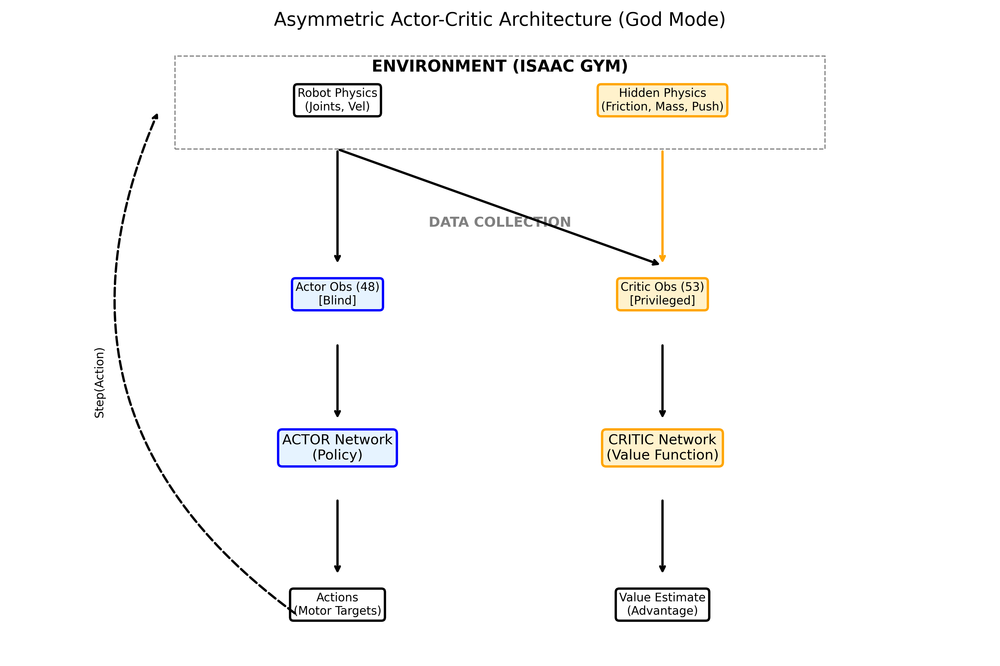
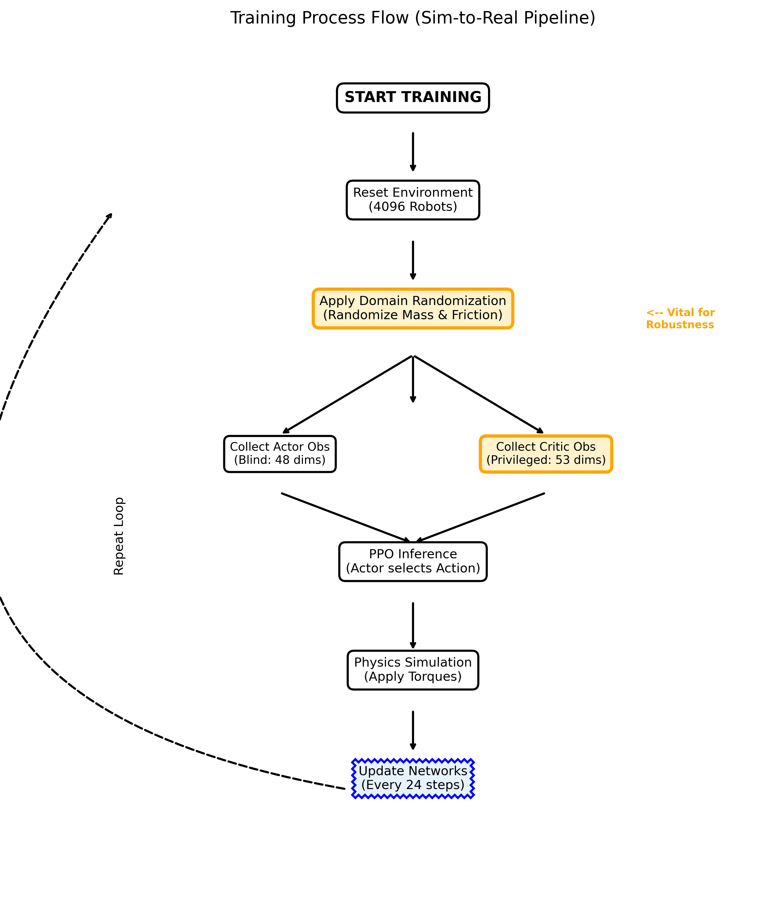
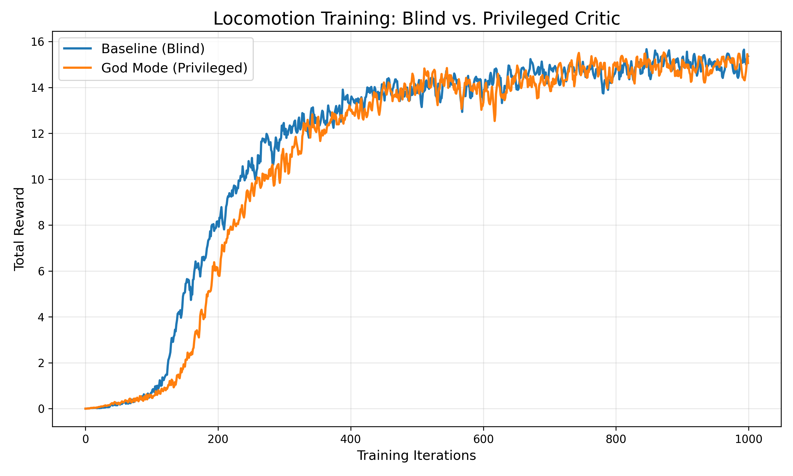
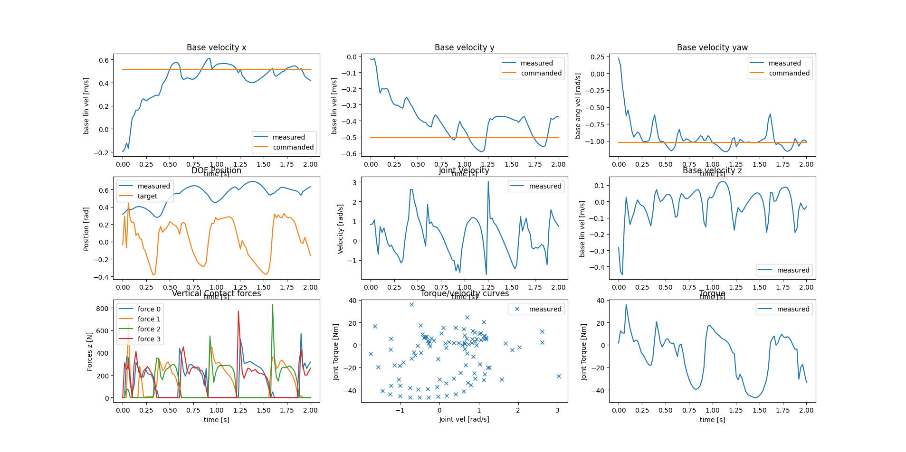
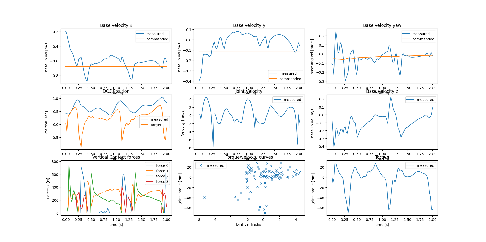
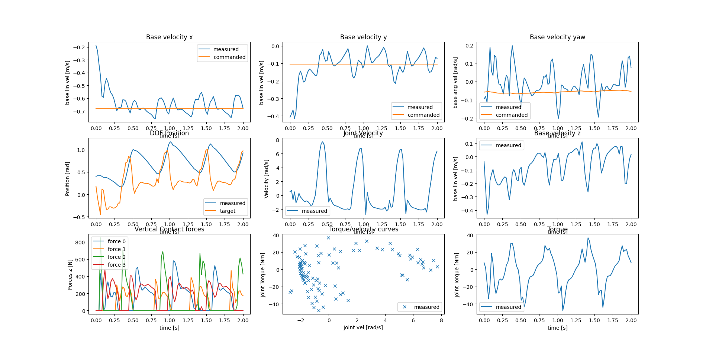

Here is the complete, professional **README.md** ready for your GitHub.

**Instructions:**
1.  Copy this text into your `README.md` file.
2.  Ensure you have the following images in your repository (rename your screenshots to match these names, or update the names in the text):
    *   `architecture_diagram.png` (The network flowchart)
    *   `process_flowchart.png` (The training loop flowchart)
    *   `comparison_result.png` (The reward graph)
    *   `god_mode_ice.png` (The plot showing the 800N spike on ice)
    *   `merged_mode_rough.png` (The rough terrain result)
    *   `standard_mode_rough.png` (The baseline rough terrain result with the -8 rad/s slip)

---

```markdown
# Bridging the Reality Gap: Robust Locomotion via Asymmetric Actor-Critic

**Author:** Mohammed Almaswary 517097
**Date:** February 2026
**Task:** BE2R Lab Selection Task

## 1. Abstract
This project addresses the **Sim-to-Real gap** in quadrupedal locomotion. Standard Deep Reinforcement Learning policies often fail when deployed on real hardware due to **unmodeled dynamics** (e.g., variable friction, payload changes, external disturbances). A standard "Blind" policy overfits to the simulator's specific physics, leading to catastrophic failure when real-world conditions differ even slightly.

I hypothesize that an **Asymmetric Actor-Critic** architecture—where the Critic has access to **Privileged Causal Factors** (friction, mass) while the Actor remains blind—will lead to a more robust policy. This setup forces the policy to learn an implicit "conservative" gait that generalizes to unseen environments without requiring complex sensors on the physical robot.

## 2. Methodology

I utilized the **Isaac Gym** simulator to train an ANYmal C robot using Proximal Policy Optimization (PPO).

### System Architecture
The following diagram illustrates the Asymmetric information flow implemented in this project. The **Critic** acts as a "Teacher" with access to the simulator's hidden physics state, guiding the "Student" (**Actor**) which sees only realistic proprioception.



### Training Process & Domain Randomization
To ensure the privileged features were meaningful, I implemented aggressive **Domain Randomization**. The Critic learns to associate specific physical parameters with expected future rewards, creating a gradient signal that teaches the Actor to adapt.



*   **Friction:** Randomized between `0.5` (ice) and `1.25` (rubber).
*   **Mass:** Randomized payload between `-1.0 kg` and `+3.0 kg`.
*   **Perturbations:** Random external pushes applied to the robot's base.

### Experimental Setup
I conducted three distinct experiments to validate the hypothesis:

| Experiment | Task Config | Actor Input | Critic Input | Description |
| :--- | :--- | :--- | :--- | :--- |
| **A. Baseline** | Flat Terrain | 48 (Proprioception) | 48 (Proprioception) | Standard "Blind" policy. |
| **B. God Mode** | Flat Terrain | 48 (Proprioception) | **53** (48 + Friction/Mass/Push) | **Asymmetric Critic.** Uses privileged physics. |
| **C. Unified** | Rough Terrain | 235 (Proprio + Vision) | **240** (235 + Friction/Mass/Push) | **Merged Architecture.** Combines Vision with Physics. |

---

## 3. Results: The Physics of Robustness

I conducted a comparative study between the Baseline and the Asymmetric (God Mode) policy over 1000 training iterations on flat ground.


*Figure 1: Training Reward Curves. The Asymmetric Policy (Orange) converges to the same high-performance level as the Baseline (Blue), demonstrating that the added complexity of privileged inputs does not hinder learning stability.*

### Analysis of Behavior (The "Stomping" Strategy)
While the reward curves are similar, the physical behavior differs significantly when tested on **Low Friction Surfaces ($\mu=0.2$)**.

| God Mode on Ice ($\mu=0.2$) |
| :---: |
|  |

**Key Finding:**
As shown in the "Vertical Contact Forces" graph (Bottom Left), the God Mode robot exhibits force spikes up to **800N** (Green Line).
*   **Physics:** $F_{friction} = \mu \times F_{normal}$.
*   **Interpretation:** The policy learned implicit system identification. It recognizes the low-friction state and reacts by **increasing the Normal Force** ("stomping") to generate sufficient traction. The Baseline policy, lacking this training signal, maintains a lower force (~600N) and slips.

---

## 4. Advanced Extension: Unified Perception Architecture

Building on the success of the God Mode experiment, I proposed and trained a **Unified Architecture** that combines **Exteroception (Terrain Vision)** with **Privileged Physics**.

*   **Goal:** Create a policy that is both **Geometrically Aware** (can climb stairs) and **Dynamically Robust** (can handle slippery stairs).
*   **Implementation:** The Actor receives a 187-dimensional height scan + 48-dimensional proprioception. The Critic receives all of that **plus** the 5 privileged physics parameters.

### Comparative Analysis on Rough Terrain

| Standard Mode (Vision Only) | Merged Mode (Vision + Physics) |
| :---: | :---: |
|  |  |

**Stability Analysis:**
*   **Standard Mode:** Exhibits a "Near-Failure" event (see Center Graph). The Joint Velocity spikes to **-8 rad/s**, and the Torque saturates at **-40 Nm**. This indicates a slip event where the robot panic-corrected to avoid falling.
*   **Merged Mode:** Maintains a controlled gait with joint velocities constrained within **±7 rad/s**. The absence of panic spikes suggests the robot successfully anticipated the surface dynamics, leading to smoother traversal.

---

## 5. Limitations & Future Work

While the Asymmetric Actor-Critic successfully improved robustness, several open questions remain:

1.  **Estimator Latency:** In a real-world deployment, we cannot feed privileged info to the Critic. While the Actor is blind, further robustness could be achieved by training a **Student Network (RMA)** to explicitly estimate the friction vector $z_t$ from the robot's history.
2.  **Terrain Geometry:** My current "God Mode" focused on physical parameters (friction/mass). Expanding this to include "Privileged Geometry" (perfect mesh knowledge) could help the robot navigate complex loose debris where vision fails.
3.  **Energy Efficiency:** The "Stomping Strategy" observed on ice provides traction but consumes high energy. A future reward function could penalize **Cost of Transport (CoT)** to force the agent to find a traction strategy that is both robust and efficient.

---

## 6. Reproduction Instructions

### Installation
This repository requires NVIDIA Isaac Gym (Preview 3 or 4).

```bash
# Clone the repository
git clone https://github.com/almaswari/robust-locomotion-isaac.git
cd legged_gym

# Install dependencies
pip install -e .
```

### Running the Experiments

**1. Train the Baseline (Blind)**
```bash
python legged_gym/scripts/train.py --task=anymal_c_flat --num_envs=1024 --max_iterations=1000 --headless --experiment_name=baseline_test
```

**2. Train God Mode (Asymmetric)**
```bash
python legged_gym/scripts/train.py --task=anymal_c_flat --num_envs=1024 --max_iterations=1000 --headless --experiment_name=god_mode_test
```

**3. Train Unified Mode (Rough Terrain)**
```bash
# Edit legged_robot_config.py to enable measure_heights=True
python legged_gym/scripts/train.py --task=anymal_c_rough --num_envs=1024 --max_iterations=1500 --headless --experiment_name=merged_mode_test
```

**4. Visualize Results**
```bash
python plot_comparison.py
```

---
---


# Appendix: Original Framework Documentation

The following is the documentation for the base `legged_gym` library used to facilitate this research.

# Isaac Gym Environments for Legged Robots

This repository provides the environment used to train ANYmal (and other robots) to walk on rough terrain using NVIDIA's Isaac Gym.

It includes all components needed for sim-to-real transfer: actuator network, friction & mass randomization, noisy observations and random pushes during training.  

**Maintainer**: Nikita Rudin  
**Affiliation**: Robotic Systems Lab, ETH Zurich  
**Contact**: rudinn@ethz.ch  

---

### :bell: Announcement (09.01.2024)

With the shift from Isaac Gym to Isaac Sim at NVIDIA, we have migrated all the environments from this work to [Isaac Lab](https://github.com/isaac-sim/IsaacLab). Following this migration, this repository will receive limited updates and support. We encourage all users to migrate to the new framework for their applications.

Information about this work's locomotion-related tasks in Isaac Lab is available [here](https://isaac-sim.github.io/IsaacLab/main/source/overview/environments.html#locomotion).

---

### Useful Links

Project website: https://leggedrobotics.github.io/legged_gym/   
Paper: https://arxiv.org/abs/2109.11978

### Installation

1. Create a new python virtual env with python 3.6, 3.7 or 3.8 (3.8 recommended)
2. Install pytorch 1.10 with cuda-11.3:
    - `pip3 install torch==1.10.0+cu113 torchvision==0.11.1+cu113 torchaudio==0.10.0+cu113 -f https://download.pytorch.org/whl/cu113/torch_stable.html`
3. Install Isaac Gym
   - Download and install Isaac Gym Preview 3 (Preview 2 will not work!) from https://developer.nvidia.com/isaac-gym
   - `cd isaacgym/python && pip install -e .`
   - Try running an example `cd examples && python 1080_balls_of_solitude.py`
   - For troubleshooting check docs `isaacgym/docs/index.html`)
4. Install rsl_rl (PPO implementation)
   - Clone https://github.com/leggedrobotics/rsl_rl
   -  `cd rsl_rl && git checkout v1.0.2 && pip install -e .` 
5. Install legged_gym
    - Clone this repository
   - `cd legged_gym && pip install -e .`

### CODE STRUCTURE

1. Each environment is defined by an env file (`legged_robot.py`) and a config file (`legged_robot_config.py`). The config file contains two classes: one containing  all the environment parameters (`LeggedRobotCfg`) and one for the training parameters (`LeggedRobotCfgPPo`).  
2. Both env and config classes use inheritance.  
3. Each non-zero reward scale specified in `cfg` will add a function with a corresponding name to the list of elements which will be summed to get the total reward.  
4. Tasks must be registered using `task_registry.register(name, EnvClass, EnvConfig, TrainConfig)`. This is done in `envs/__init__.py`, but can also be done from outside of this repository.  

### Usage

1. Train:  
  ```python legged_gym/scripts/train.py --task=anymal_c_flat```
    -  To run on CPU add following arguments: `--sim_device=cpu`, `--rl_device=cpu` (sim on CPU and rl on GPU is possible).
    -  To run headless (no rendering) add `--headless`.
    - **Important**: To improve performance, once the training starts press `v` to stop the rendering. You can then enable it later to check the progress.
    - The trained policy is saved in `issacgym_anymal/logs/<experiment_name>/<date_time>_<run_name>/model_<iteration>.pt`. Where `<experiment_name>` and `<run_name>` are defined in the train config.
    -  The following command line arguments override the values set in the config files:
     - --task TASK: Task name.
     - --resume:   Resume training from a checkpoint
     - --experiment_name EXPERIMENT_NAME: Name of the experiment to run or load.
     - --run_name RUN_NAME:  Name of the run.
     - --load_run LOAD_RUN:   Name of the run to load when resume=True. If -1: will load the last run.
     - --checkpoint CHECKPOINT:  Saved model checkpoint number. If -1: will load the last checkpoint.
     - --num_envs NUM_ENVS:  Number of environments to create.
     - --seed SEED:  Random seed.
     - --max_iterations MAX_ITERATIONS:  Maximum number of training iterations.

2. Play a trained policy:  
```python legged_gym/scripts/play.py --task=anymal_c_flat```
    - By default, the loaded policy is the last model of the last run of the experiment folder.
    - Other runs/model iteration can be selected by setting `load_run` and `checkpoint` in the train config.

### Adding a new environment

The base environment `legged_robot` implements a rough terrain locomotion task. The corresponding cfg does not specify a robot asset (URDF/ MJCF) and has no reward scales. 

1. Add a new folder to `envs/` with `'<your_env>_config.py`, which inherit from an existing environment cfgs  
2. If adding a new robot:
    - Add the corresponding assets to `resources/`.
    - In `cfg` set the asset path, define body names, default_joint_positions and PD gains. Specify the desired `train_cfg` and the name of the environment (python class).
    - In `train_cfg` set `experiment_name` and `run_name`
3. (If needed) implement your environment in <your_env>.py, inherit from an existing environment, overwrite the desired functions and/or add your reward functions.
4. Register your env in `isaacgym_anymal/envs/__init__.py`.
5. Modify/Tune other parameters in your `cfg`, `cfg_train` as needed. To remove a reward set its scale to zero. Do not modify parameters of other envs!

### Troubleshooting

1. If you get the following error: `ImportError: libpython3.8m.so.1.0: cannot open shared object file: No such file or directory`, do: `sudo apt install libpython3.8`. It is also possible that you need to do `export LD_LIBRARY_PATH=/path/to/libpython/directory` / `export LD_LIBRARY_PATH=/path/to/conda/envs/your_env/lib`(for conda user. Replace /path/to/ to the corresponding path.).

### Known Issues

1. The contact forces reported by `net_contact_force_tensor` are unreliable when simulating on GPU with a triangle mesh terrain. A workaround is to use force sensors, but the force are propagated through the sensors of consecutive bodies resulting in an undesirable behaviour. However, for a legged robot it is possible to add sensors to the feet/end effector only and get the expected results. When using the force sensors make sure to exclude gravity from the reported forces with `sensor_options.enable_forward_dynamics_forces`. Example:
```python
    sensor_pose = gymapi.Transform()
    for name in feet_names:
        sensor_options = gymapi.ForceSensorProperties()
        sensor_options.enable_forward_dynamics_forces = False # for example gravity
        sensor_options.enable_constraint_solver_forces = True # for example contacts
        sensor_options.use_world_frame = True # report forces in world frame (easier to get vertical components)
        index = self.gym.find_asset_rigid_body_index(robot_asset, name)
        self.gym.create_asset_force_sensor(robot_asset, index, sensor_pose, sensor_options)
    (...)
    sensor_tensor = self.gym.acquire_force_sensor_tensor(self.sim)
    self.gym.refresh_force_sensor_tensor(self.sim)
    force_sensor_readings = gymtorch.wrap_tensor(sensor_tensor)
    self.sensor_forces = force_sensor_readings.view(self.num_envs, 4, 6)[..., :3]
    (...)
    self.gym.refresh_force_sensor_tensor(self.sim)
    contact = self.sensor_forces[:, :, 2] > 1.
```
```